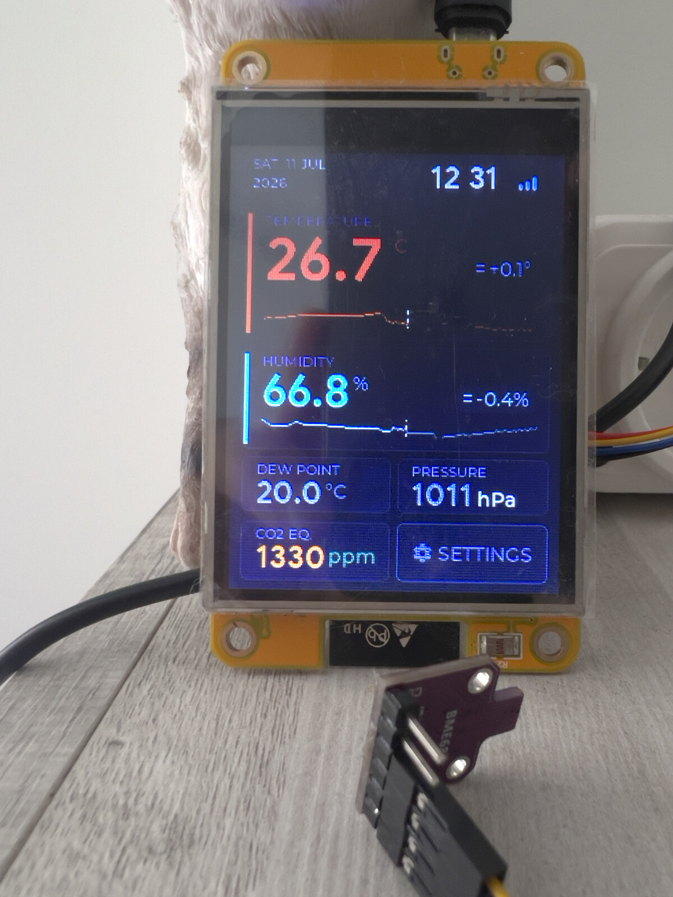

# SensorStation3

An open-source ESP32-based environmental monitoring station — temperature, humidity, atmospheric pressure, CO2 (equivalent), and dew point, with a built-in touchscreen dashboard, MQTT/cloud integration, and OTA firmware updates.

<p align="center">
  
</p>

## Features

- **Built-in touchscreen dashboard** running on an ESP32 CYD (Cheap Yellow Display) board — both ILI9341 and ST7789 panel variants are supported and auto-detected at boot, no configuration needed:
  - Date, time, and Wi-Fi signal strength
  - Current temperature with a 24-hour graph, trend, and rate of change
  - Current humidity with a 24-hour graph, trend, and rate of change
  - Calculated dew point
  - Atmospheric pressure
  - CO2 (equivalent) level, when a compatible sensor is connected
  - On-device settings screen
- **Automatic I2C sensor detection** — no manual configuration needed for supported sensors
- **NTP time sync** with configurable timezone, refreshed hourly
- **Temperature offset compensation** for BME680 (-5 °C to +5 °C), useful when the sensor is affected by nearby heat sources
- **MQTT integration** with [ThingsBoard](https://thingsboard.io/), [Domoticz](https://www.domoticz.com/), and [Home Assistant](https://www.home-assistant.io/) (via MQTT Discovery — sensors are auto-detected, no manual entity setup needed)
- **OTA firmware updates** — automatic update check with on-screen notification, and optional automatic install
- **Auto-dimming backlight** driven by the onboard LDR (light sensor)

## Supported sensors

Sensors are detected automatically over I2C — just wire one up and it's picked up without any configuration.

| Sensor | Measures                                                                   | Status |
|---|----------------------------------------------------------------------------|---|
| BMP280 | Temperature, pressure                                                      | ✅ Supported |
| BME280 | Temperature, humidity, pressure                                            | ✅ Supported |
| BME680 (without BSEC) | Temperature, humidity, pressure, gas resistance, CO2-equivalent based on sensor resistance | ✅ Supported |
| BME680 (with BSEC) | Temperature, humidity, pressure, gas resistance, IAQ / CO2-equivalent      | ✅ Supported — requires the proprietary Bosch BSEC library, see [Building with BSEC](#building-with-bsec) |
| SCD40 / SCD41 | CO2 (direct NDIR measurement), temperature, humidity                       | 🚧 Planned |
| SHT35 | Temperature, humidity (high precision)                                     | 🚧 Planned |

> **Note on CO2:** the BME680 with BSEC reports an *IAQ-derived CO2-equivalent*, not a direct CO2 measurement. For an actual NDIR CO2 sensor, SCD40/41 support is on the roadmap.

## Hardware

- **Board:** [ESP32 CYD](https://github.com/witnessmenow/ESP32-Cheap-Yellow-Display) (ESP32 with an integrated TFT touchscreen) — CYD boards ship with either an ILI9341 or ST7789 display controller depending on revision; the firmware detects which one is present automatically
- **Sensors:** any supported I2C sensor from the table above, connected externally via the board's I2C header
- A 3D-printable enclosure that houses the sensor together with the board is planned — see [Roadmap](#roadmap)

## Getting started

### Prerequisites

- [ESP-IDF](https://docs.espressif.com/projects/esp-idf/en/latest/esp32/get-started/index.html) **v6.0.x** — earlier major versions (5.x) are not supported, the driver/component APIs this project relies on differ significantly
- Git
- A supported I2C sensor wired to the board (I2C pins depend on your CYD variant — check `docs/` for pinout, if available)

### Building with BSEC

If you're using a BME680 and want IAQ / CO2-equivalent output, the project depends on Bosch Sensortec's proprietary **BSEC** library (built against v2.6.1.0). It is **not redistributed** in this repository — you need to download it yourself directly from Bosch and accept their license terms:

1. Go to the [Bosch Sensortec BSEC software page](https://www.bosch-sensortec.com/software-tools/software/bsec/) and download the BSEC library.
2. Extract the archive and copy its `algo` directory into `components/bsec/algo/` in this repo, so that these paths exist:
   - `components/bsec/algo/bsec_IAQ/inc/`
   - `components/bsec/algo/bsec_IAQ/config/bme680/bme680_iaq_33v_3s_4d/`
   - `components/bsec/algo/bsec_IAQ/bin/esp/esp32/libalgobsec.a`
3. Build as usual with `idf.py build` — BSEC is picked up automatically once the library is in place.

If you'd rather not obtain BSEC, disable it before building:

```bash
idf.py menuconfig
# → SensorStation3 → uncheck "Enable BSEC air-quality processing for BME680"
```

With BSEC disabled, BME680 still reports temperature/humidity/pressure/gas resistance and an approximate CO2-equivalent, just without BSEC's IAQ/static_iaq/accuracy outputs. BMP280/BME280 builds are unaffected either way.

### Build and flash

```bash
git clone https://github.com/ScorpionZZZ/SensorStation3.git
cd SensorStation3

idf.py set-target esp32
idf.py build
idf.py -p /dev/ttyUSB0 flash monitor
```

Replace `/dev/ttyUSB0` with your board's serial port (on Windows, something like `COM3`).

### First boot

1. On first boot, open the **Settings** screen on the touchscreen (default PIN `1234`) → **WiFi**. It scans for nearby networks — pick yours and enter the password on the on-screen keyboard.
2. Still in Settings, configure timezone, MQTT/ThingsBoard/Domoticz/Home Assistant connection, and sensor options.
3. **Change the default settings PIN (`1234`) immediately** after your first boot.

## Configuration

All runtime configuration (Wi-Fi, MQTT broker, timezone, temperature offset, etc.) is stored in NVS and managed through the on-device Settings screen — no config file needs to be edited before building.

## OTA updates

The device periodically checks for new firmware releases and shows an on-screen indicator when an update is available. Automatic installation can be enabled in Settings.

## Roadmap

- [ ] SCD40/41 support (direct CO2 measurement)
- [ ] SHT35 support (high-precision temperature/humidity)
- [ ] 3D-printable enclosure integrating the sensor inside the case
- [ ] Web-based flashing (flash firmware from the browser, no local toolchain required)

Track progress and open tasks in [Issues](https://github.com/ScorpionZZZ/SensorStation3/issues).

## Contributing

Issues and pull requests are welcome. If you'd like to contribute, please open an issue first to discuss what you'd like to change.

## License

This project's source code is licensed under the [Apache License 2.0](LICENSE).

This project uses the Bosch Sensortec **BSEC** library for BME680 IAQ processing. BSEC is proprietary and **not included** in this repository — see [NOTICE](NOTICE) and [Building with BSEC](#building-with-bsec) for details.